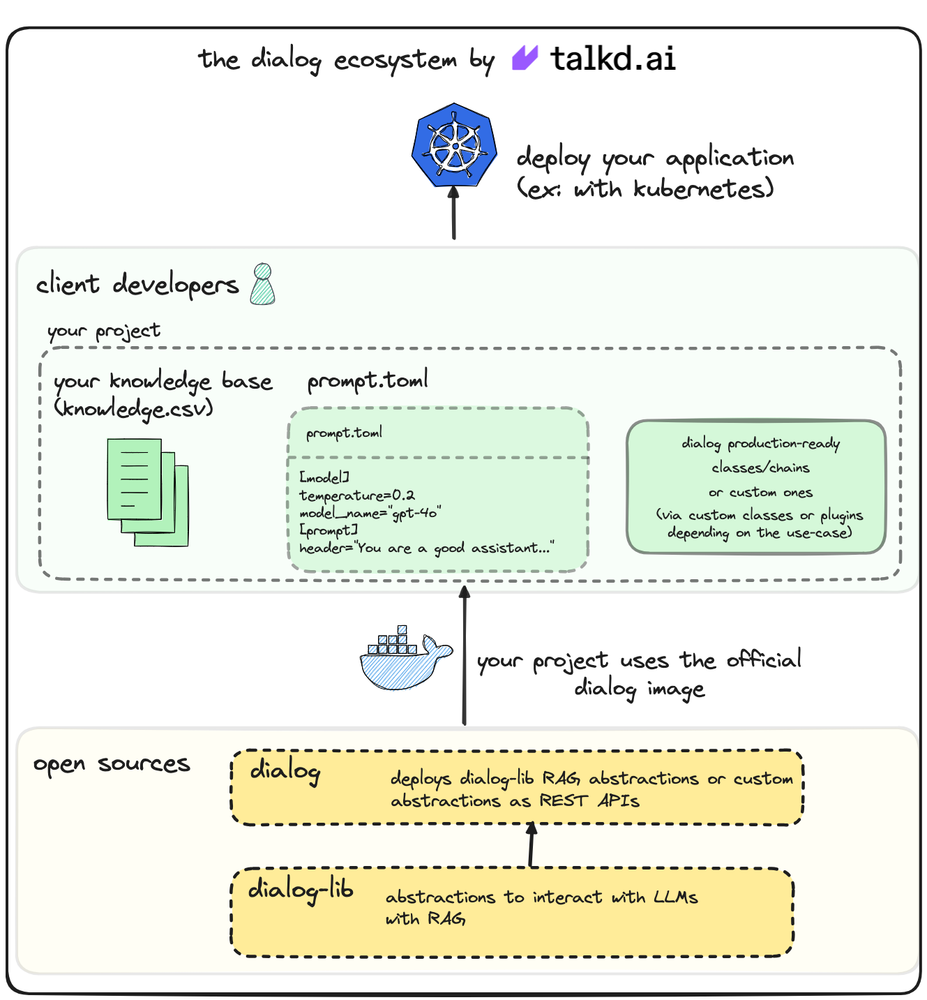

<p align="center">
 

 [](https://discord.gg/dPAcsn3Ch7)

</p>

# talkd/dialog

For programmers, who are interested in AI and are deploying RAGs without knowledge on API development, Dialog is an App to simplify RAG deployments, using the most modern frameworks for web and LLM interaction, letting you spend less time coding and more time training your model.

This repository serves as an API focused on letting you deploy any LLM you want, based on the structure provided by [dialog-lib](https://github.com/talkdai/dialog-lib).

We started focusing on humanizing RAGs (making the answer scope very delimited and human-like sounding), but we are expanding for broader approaches to improving RAG deployment and maintenance for everyone. Check out our current architecture below and, for more information, check our [documentation](https://dialog.talkd.ai)!


<p align="center">
    <a href="docs/dialog-architecture.png">
        
    </a>
</p>


## Running the project for the first time

We assume you are familiar with [Docker](https://www.docker.com/), if you are not, this [amazing video tutorial](https://www.youtube.com/watch?v=pTFZFxd4hOI&ab_channel=ProgrammingwithMosh) will help you get started. If you want a more detailed getting started, follow the [Quick Start session from our docs](docs/quick-start.md) for setup.

To run the project for the first time, you need to have Docker and Docker Compose installed on your machine. If you don't have it, follow the instructions on the [Docker website](https://docs.docker.com/get-docker/).

After installing Docker and Docker Compose, clone the repository and run the following command:

```bash
cp .env.sample .env
```
Inside the `.env` file, set the `OPENAI_API_KEY` variable with your OpenAI API key.

Then, run the following command:

```bash
docker-compose up
```

it will start two services:
- `db`: where the PostgresSQL database runs to support chat history and document retrieval for [RAG](https://en.wikipedia.org/wiki/Prompt_engineering#Retrieval-augmented_generation);

- `dialog`: the service with the api.

### Using Open-WebUI as front-end

In partnership with [Open-WebUI](https://github.com/open-webui/open-webui/), we made their chat interface our own as well, if you want to use it on your own application, change the docker-compose file to use the `docker-compose-open-webui.yml` file:

```bash
docker-compose -f docker-compose-open-webui.yml up
```

### Tutorials

We've written some tutorials to help you get started with the project:

 - [Deploy your own ChatGPT in 5 minutes](https://dev.to/vmesel/deploy-your-own-chatgpt-in-5-minutes-5d41)
 - [GPT-4o: Learn how to Implement a RAG on the new model, step-by-step!](https://dev.to/vmesel/gpt-4o-learn-how-to-implement-a-rag-on-the-new-model-step-by-step-377d)

Also, you can check our [documentation](https://dialog.talkd.ai) for more information.

## Maintainers

We are thankful for all of the contributions we receive, mostly reviewed by this awesome maintainers team we have:

 - [avelino](https://github.com/avelino)
 - [vmesel](https://github.com/vmesel)
 - [walison17](https://github.com/walison17)
 - [lgabs](https://github.com/lgabs/)

made with 💜 by [talkd.ai](https://talkd.ai)
